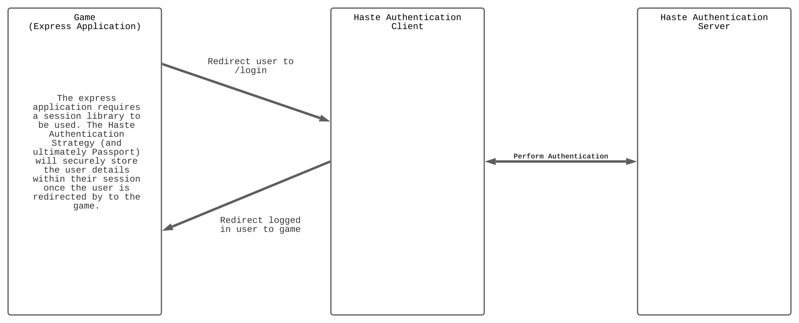

# @hastearcade/haste-express

[](https://badge.fury.io/js/@hastearcade%2Fhaste-express)

## Overview

The `@hastearcade/haste-express` SDK empowers developers to incoroporate the Haste authentication system into their express based game. The SDK is intended to be used only on an express application and has a few required dependencies. Specifically `express` and `passport`. Additionally you will need to ensure you are using some type of session library for Express. In the example application, `express-session` is used.

See [here](https://github.com/playhaste/haste-sdk/blob/main/README.md) for an overview of the haste-sdk repository.

## Table of Contents

- [Quickstart](#quickstart)
- [Background and Use Case](#background)
- [Setup](#setup)
- [Testing](#testing)
- [Documentation](#documentation)
- [License](#license)
- [Contributing](#contributing)
- [Authors](#authors)

## Quickstart

You can view a sample express application with the integrated `@hastearcade/haste-express` package [here](../examples/authentication/regular-web-app). It is intended to run as a standalone application that only performs the authentication.

First you will need to register your game at the [Haste Developer Portal](https://developer.hastearcade.com) to retrieve your client credentials.

The client id used here can be found in the developer portal and will be for your game. See image below for a reference point:


You will need to define the following environment variables within your express application

- AUTH0_DOMAIN=auth.hastearcade.com
- AUTH0_CLIENT_ID=CLIENT_ID_FROM_DEVELOPER_PORTAL
- AUTH0_CLIENT_SECRET=CLIENT_SECRET_FROM_DEVELOPER_PORTAL
- AUTH0_CALLBACK_URL= - this should be your root url and /callback. So http://localhost:3002/callback as an example

Once you have the environment variables configured, you need to layer in a few small bits of code

### Initialization

```javascript
import session from 'express-session';
import passport from 'passport';
import { hasteAuthRoutes, hasteUserInViews, HasteStrategy } from '@hastearcade/haste-express';

// This registers the Haste authorization strategy
// within passport so that passport's authenticate
// call within the login route from hasteAuthRoutes
// can reference this strategy.
passport.use(HasteStrategy.initialize());

const sess = {
  secret: 'shhhh', // this would change in a real application
  resave: false,
  saveUninitialized: true,
  cookie: {},
};

const app = express();

app.use(session(sess));
app.use(passport.initialize());
app.use(passport.session());

// haseUserInViews provides access to a user object
// within the view engines on a `user` property. It
// includes a displayName attribute as well as picture for their avatar.
app.use(hasteUserInViews());

// hasteAuthRoutes creates 3 routes that should be
// done off the index route. `/login`, `/callback` and `/logout`.
// You should not need to configure these directly.
app.use('/', hasteAuthRoutes);
```

## Login

If the player is unauthenticated, then please present the user with the ['Sign in with Haste' branded button](https://www.hastearcade.com/brand).

The button should redirect the user to the `/login` route created by registered `hasteAuthRoutes` within express. In the example app, it uses the following code to do so:

```jade
// layout.jade
script.
  function login() {
    window.location.href = '/login'
  }

  function logout() {
    window.location.href = '/logout'
  }
```

```jade
// index.jade
extends layout

block content
  h1= title
  if locals.user
    p Welcome #{user.displayName} to #{title}
    div(class="header")
      img(src=user.picture, class='logo')
      button(onclick="logout()" class="button") Sign Out
  else
    p Welcome to #{title}
    button(onclick="login()" class="nobutton")
      img(src= './images/login.svg', class='logo')
```

If the player is already authenticated, then you can present the player with the leaderboard selection. The leaderboard selection will allow the player to select the payment amount and level they are playing for the Arcade. To display the leaderboards the developer will need to utilize the [server side SDK](https://github.com/hastearcade/haste-sdk/tree/main/packages/server).



#### Logout

A logout button should redirect the user to the `/logout` route created by registered `hasteAuthRoutes` within express. See the Login section above for an example.

## Background

See [here](https://github.com/playhaste/haste-sdk/blob/main/README.md#Background) for a detailed background.

## Setup

See [here](https://github.com/playhaste/haste-sdk/blob/main/README.md#Setup) for a detailed setup guide.

### Testing

`@hastearcade/haste-express` does not currently have any tests.

`npm run test`

## Documentation

This `README` and each package's `README` provides high-level documentation. Additionally the code has been reviewed and comments provided to aid future developers in understanding why certain decisions were made.

## License

The haste-sdk repository along with the corresponding npm packages are currently licensed under [MIT](https://github.com/playhaste/haste-sdk/blob/main/LICENSE)

## Contributing

If you are a developer looking to contribute to the Haste ecosystem please review our
[Contributing Readme](https://github.com/playhaste/haste-sdk/blob/main/ContributingReadme.md) and our [Contributing Guidelines](https://github.com/playhaste/haste-sdk/blob/main/CONTRIBUTING.md)

## Authors

- Keith LaForce ([rallieon](https://github.com/rallieon/))
- Eric LaForce ([foundrium](https://github.com/foundrium/))
- Dan Wagner ([danwag06](https://github.com/danwag06))
